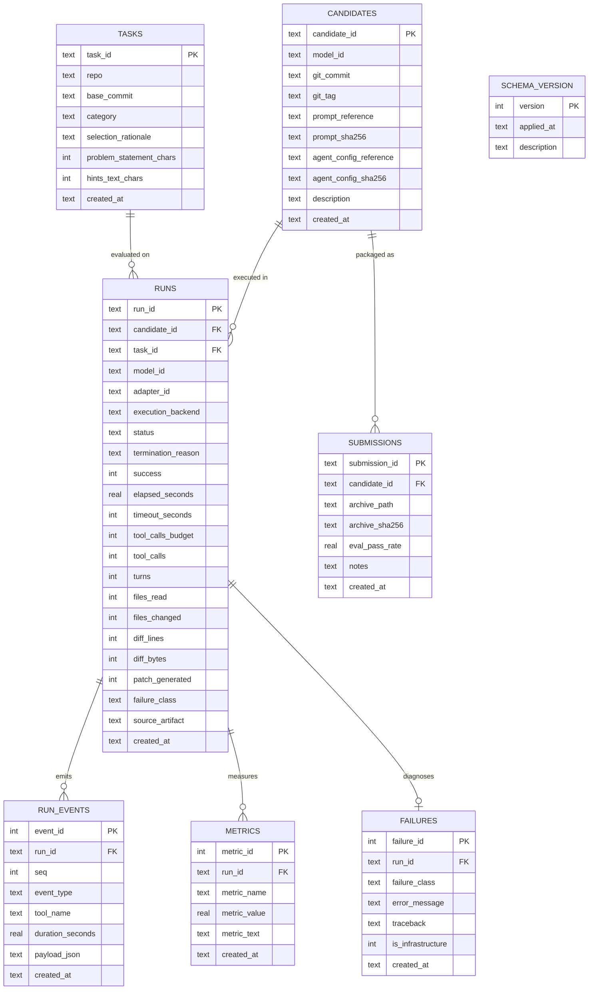

# Architecture Decision Record — Evaluation Database

**Document ID:** DEC-EVALUATION-DATABASE  
**Status:** Accepted & Implemented (Stage 9)  
**Date:** 2026-09-26  
**Authoritative References:** [PLAN.md](file:///E:/Projects/Impulse/PLAN.md) (Section 11, Stage 9), [IMPULSE.md](file:///E:/Projects/Impulse/IMPULSE.md), [AGENTS.md](file:///E:/Projects/Impulse/AGENTS.md) (Section 2.5 Zero Fabrication)

---

## 1. Context & Purpose

Stage 9 of IMPULSE requires a lightweight, reproducible experiment store to ingest, persist, query, and compare candidate evaluation results across iterations (from frozen baseline E0 through subsequent candidate releases E1, E2, etc.).

Per **PLAN.md Stage 9** and the **IMPULSE Constitution (AGENTS.md)**:
- The system must use standard library `sqlite3` without heavy external database services or heavyweight ORMs.
- The schema must distinguish candidates, benchmark tasks, individual execution runs, granular run/tool events, arbitrary metric values, failure categorizations, and competition submissions.
- The database must support **strictly nullable metrics** so that infrastructure-unavailable runs (such as the local workstation baseline where 4× NVIDIA L4 GPUs are unavailable) remain recorded as `NULL` rather than coerced to deceptive `0` values.
- Ingestion must be **idempotent**, enabling repeated re-ingestion of manifests and result files without duplicating records or corrupting foreign key relationships.

---

## 2. Relational Schema Architecture

The evaluation database is structured around 8 relational tables:



### Table Specifications:
1. **`schema_version`**: Records applied schema revisions with UTC timestamps for forward migration safety.
2. **`tasks`**: Stores non-sensitive benchmark problem catalog (repository, commit, category, rationale, character lengths). **Never stores golden solution patches or secret test patches.**
3. **`candidates`**: Tracks model identifier, Git commit, Git tag, prompt path/hash, and configuration path/hash for each candidate (e.g. `E0`, `E1`).
4. **`runs`**: Primary execution record connecting a candidate and a task. Contains timing, budget limits, resolution state (`success`: 1, 0, or NULL), tool usage, and diff dimensions.
5. **`run_events`**: Detailed tool call traces, turn boundaries, and execution sequences for in-depth trajectory analysis.
6. **`metrics`**: Extensible key-value table for arbitrary numerical and textual measurements per run.
7. **`failures`**: Failure classification, distinguishing task-logic failures from infrastructure constraints via `is_infrastructure` flag.
8. **`submissions`**: Archive paths, SHA-256 hashes, and verified pass rates for candidate competition ZIP releases.

---

## 3. Design Decisions & Implementation Principles

### 3.1. Standard Library SQLite & Zero Heavy Dependencies
- Uses Python's built-in `sqlite3` module.
- Avoids external ORMs (e.g. SQLAlchemy, Django ORM) to keep the repository minimalist, fast, and fully reproducible across minimal environments.
- Enforces relational integrity on every connection via `PRAGMA foreign_keys = ON;`.

### 3.2. Strict Anti-Fabrication & Nullable Metrics
In compliance with **AGENTS.md Section 2.5**:
- When model inference was not executed (such as on the local Windows development workstation during Stage 8), performance metrics (`success`, `tool_calls`, `turns`, `files_read`, `files_changed`, `diff_bytes`) remain stored as `NULL`.
- In SQL summaries (`queries.get_candidate_summary`), pass rate is calculated strictly over executed runs:
  $$\text{pass\_rate} = \frac{\text{resolved}}{\text{resolved} + \text{failed}}$$
  If total executed runs is 0, `pass_rate` evaluates to `None` (`NULL`), **never 0%**.
- Infrastructure failures (`is_infrastructure = 1`) are explicitly segregated from genuine agent reasoning failures.

### 3.3. Idempotent Ingestion Workflow
- Ingestion (`ingestion.ingest_results` and `ingestion.ingest_manifest`) uses `ON CONFLICT(...) DO UPDATE` patterns.
- Re-running ingestion on existing result files or manifests updates existing records in-place without duplicating primary keys or incrementing counts.
- Foreign key dependencies are automatically satisfied by pre-populating task metadata from `data/competition/tasks.jsonl` or `benchmark/tasks/smoke.jsonl`.

### 3.4. Git Hygiene & Artifact Isolation
- Generated SQLite databases (`*.db`, `*.sqlite`, `*.sqlite3`) are explicitly ignored in `.gitignore`.
- Schema definitions, migration logic, and ingestion tools are tracked in Git under `local/evaluation/`.
- Runtime evaluation stores are created on-demand via `python -m local.evaluation init --db <path>` or automatically during ingestion.

---

## 4. CLI Usage Reference

The package exposes a command-line interface via `python -m local.evaluation`:

```powershell
# 1. Initialize evaluation database schema
python -m local.evaluation init [--db experiments/evaluation.db]

# 2. Ingest candidate results and companion manifest
python -m local.evaluation ingest --results experiments/baseline/E0/results.jsonl [--manifest experiments/baseline/E0/manifest.json]

# 3. View table statistics and row counts
python -m local.evaluation stats

# 4. View candidate evaluation summary (pass rate, tool averages, failure breakdown)
python -m local.evaluation summary --candidate E0

# 5. List and filter execution runs
python -m local.evaluation list-runs --candidate E0
```
