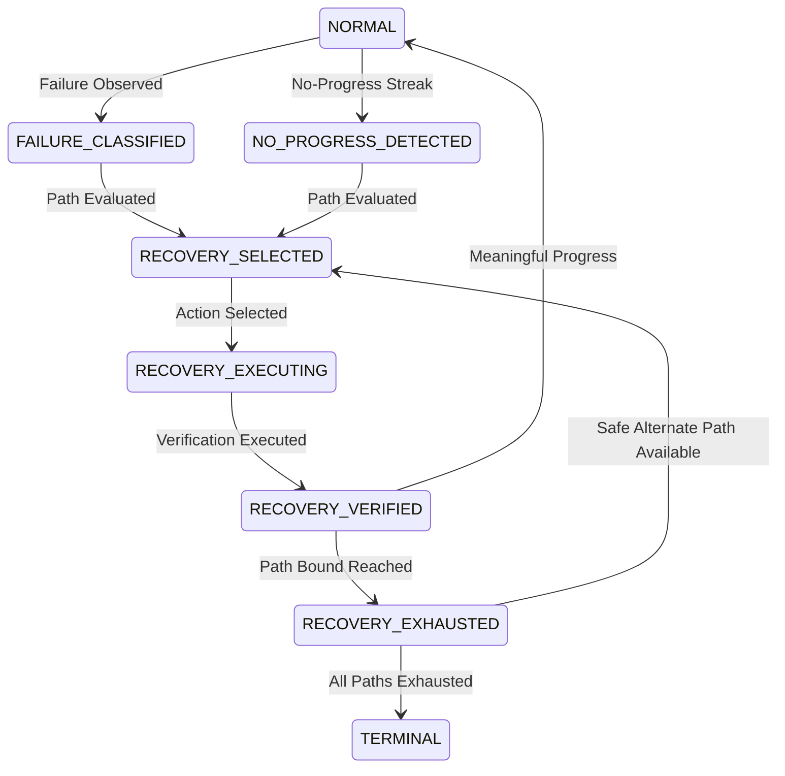

# ADR: Recovery Paths Architecture (Candidate E11 / Stage 20)

**Status:** Approved  
**Date:** 2026-09-26  
**Parent Candidate:** Candidate E10 (`7e2fd4aa707c62b6ba03d0adcf27b1212d05bb84`)  
**Scope:** Stage 20 of PLAN.md

---

## 1. Context and Problem Statement

Autonomous software engineering agents operating in repository environments frequently encounter failures:
- Test assertions fail, revealing regressions or incomplete fixes.
- Code modifications fail to parse or introduce syntax/type errors.
- Tool invocations fail due to command issues or transient platform glitches.
- Search and localization attempts yield ambiguous or unhelpful candidates.
- Budget pressure (time and tool-call limits) threatens session cutoff.

In previous stages, IMPULSE established:
- **Stage 18 (Failure Classification V1)**: Answers *"What kind of failure just occurred?"* (`ENVIRONMENT`, `COMMAND`, `PRE_EXISTING_FAILURE`, `REGRESSION`, `INCOMPLETE_FIX`, `WRONG_HYPOTHESIS`, `NEW_EDGE_CASE`, `UNKNOWN`).
- **Stage 19 (No-Progress Detection V1)**: Answers *"Has the agent stopped making meaningful progress across verification cycles?"* (`REPEATED_FAILURE`, `REPEATED_HYPOTHESIS`, `REPEATED_EDIT`, `NO_NEW_EVIDENCE`).

Stage 20 answers the vital subsequent question:
$$\text{"What bounded change of investigation or repair should the agent make after a recognized failure or no-progress condition?"}$$

Crucially, Stage 20 isolates recovery execution from diagnosis and detection. It does not merge classification, progress detection, or recovery responsibilities into an opaque monolithic system.

---

## 2. The Five Canonical Recovery Families

Stage 20 implements the five recovery families explicitly mandated by PLAN.md Section 22:

### A. Search Fallback
- **Conceptual Ladder**: `semantic -> exact search -> tree inspection -> graph`
- **Semantics**: An information-ladder fallback, not a compulsory sequence on every event.
- **Rules**:
  - Reuses existing Stage 15/E6 retrieval policy and safeguards.
  - Never repeats an exhausted retrieval method unless repository state has materially changed.
  - Obeys existing semantic retrieval limits, neighbor limits, subgraph limits, and consecutive-call constraints.
  - Terminates immediately once direct source evidence explains the defect.

### B. Test-Failure Recovery
- **Conceptual Ladder**: `classify -> inspect diff -> inspect stack/call path -> revise hypothesis`
- **Semantics**: Guided diagnosis of verification failures using E9 failure classification.
- **Rules**:
  - Consults E9 `FailureClassifierV1` output.
  - Inspects the active diff before attempting any subsequent code modifications.
  - Inspects stack traces or call paths when traceback evidence is present.
  - Explicitly revises the hypothesis when evidence contradicts earlier assumptions.
  - Runs minimal targeted verification before broadening test coverage.

### C. Bad-Edit Recovery
- **Conceptual Ladder**: `inspect diff -> repair/revert -> rerun targeted test`
- **Semantics**: The first IMPULSE stage permitted to perform bounded repair and reversion behavior.
- **Rules**:
  - Inspects the active diff first to assess responsibility.
  - Prefers narrow in-place repair (`REPAIR_EDIT`) over layering more mutations.
  - Falls back to reversion (`REVERT_EDIT`) only for agent-owned files.
  - Re-runs targeted verification immediately after repair or reversion.
  - Strictly adheres to Safe Change Ownership.

### D. Tool-Failure Recovery
- **Conceptual Ladder**: `bounded retry -> alternate tool -> continue or terminate`
- **Semantics**: Recovers from harness or tool execution failures.
- **Rules**:
  - Distinguishes tool execution errors from command syntax errors and code defect failures.
  - Enforces a strict bounded retry budget (maximum 1 retry).
  - Deterministic CLI syntax errors are never retried.
  - Falls back to compatible alternate existing competition tools (`search_similar_code` $\to$ `run_command`, `get_code_neighbors` $\to$ `read_file`, `edit_file` $\to$ `write_file`).
  - Terminates the action path cleanly when alternatives are exhausted.

### E. Budget-Pressure Recovery
- **Conceptual Ladder**: `stop low-value exploration -> targeted validation -> final review`
- **Semantics**: Triggered when tool calls ($\le 10$) or remaining time ($\le 300\text{s}$) indicate imminent resource exhaustion.
- **Rules**:
  - Immediately halts exploratory retrieval that is no longer producing fresh diagnostic evidence.
  - Retains the strongest current hypothesis and evidence.
  - Executes only high-value targeted verification.
  - Inspects the final patch diff and concludes cleanly.
  - Uses existing budget state; does not invent new budget parameters or bypass limits.

---

## 3. Safe Change Ownership & Forbidden Repository Reset

A core hazard of autonomous repair is destructive rollback that damages user work. IMPULSE establishes non-negotiable safe-change ownership rules:
1. **Ownership Distinction**:
   - Pre-existing repository modifications (unrelated user changes present before the session).
   - Agent-owned modifications (files edited or written by IMPULSE during the session).
2. **Strict File-Level Isolation**:
   - `RecoveryContext.is_safe_to_revert(file_path)` requires that the target file is in `agent_owned_files` and strictly NOT in `unrelated_modified_files`.
   - Ambiguous ownership defaults to safety: destructive reversion is prohibited, and the controller routes to non-destructive hypothesis revision (`REVISE_HYPOTHESIS`).
3. **Repository-Wide Reset Forbidden**:
   - Commands such as `git reset --hard`, `git checkout .`, `git clean -fdx`, or blanket branch rewinds are strictly forbidden.
   - Reversions are executed exclusively file-by-file on verified agent-owned files.

---

## 4. Deterministic State Machine & Loop Prevention

The recovery controller (`RecoveryControllerV1`) is structured as an explicit deterministic state machine:

### Bounded Limits and Safeguards
- `MAX_TOOL_RETRIES = 1`: Tool invocation failures may be retried at most once.
- `MAX_PATH_ATTEMPTS = 2`: A recovery path is attempted at most twice before path exhaustion.
- Exhausted paths cannot be re-entered without an intervening state transition to `NORMAL`.
- LLMs are not used for recovery routing; routing is entirely deterministic based on structured observables.

---

## 5. Interaction with E9 Failure Classification and E10 Progress State

The recovery system respects established abstractions without modification:
- **E9 Invariance**: All 8 canonical failure categories are preserved unchanged. Recovery maps categories to specific recovery pathways:
  - `REGRESSION` $\to$ Bad-Edit Recovery (`INSPECT_DIFF`, `REPAIR_EDIT`)
  - `WRONG_HYPOTHESIS` $\to$ Test-Failure Recovery (`REVISE_HYPOTHESIS`)
  - `INCOMPLETE_FIX` $\to$ Test-Failure Recovery (`INSPECT_STACK`, `TARGETED_VALIDATION`)
  - `ENVIRONMENT` / `COMMAND` $\to$ Tool-Failure Recovery or execution syntax correction
  - `UNKNOWN` $\to$ Search Fallback ladder
- **E10 Invariance**: E10 `NoProgressDetectorV1` and normalized fingerprints serve as the evidence trigger.
  - When E10 reports `PROGRESS`, recovery is not invoked.
  - When E10 reports `INSUFFICIENT_EVIDENCE`, destructive recovery is forbidden.
  - When E10 reports `NO_PROGRESS`, recovery executes, and resulting progress resets the no-progress streak via `state.reset_no_progress()`.

---

## 6. TaskState Integration & Security Hygiene

- **Evidence Recording**: Recovery decisions are integrated into existing `TaskState` via `state.add_evidence(observation=..., source="recovery_controller_v1")`.
- **Log Bounding**: Rationales and snippets are truncated (`MAX_SUMMARY_LEN = 500`) to prevent context bloat.
- **Zero Secrets**: Credentials, API tokens, and secret environment variables are never included in recovery records or context summaries.

---

## 7. Experimental Hypothesis & Future Metrics

### Hypothesis
A deterministic, bounded recovery controller implementing five specialized recovery paths with strict change-ownership safety will systematically resolve regressions, tool invocation errors, and localization dead-ends while strictly preventing infinite loops and destructive repository resets.

### Future Metrics (Unasserted at Stage 20)
- `search_fallback_resolution_rate`
- `bad_edit_recovery_success_rate`
- `safe_change_revert_accuracy`
- `tool_failure_recovery_rate`
- `budget_pressure_graceful_exit_rate`
- `pass_rate` (null at Stage 20)

---

## 8. Explicit Stage Boundaries (Hard Stop)

Candidate E11 implements **Stage 20 only**.
- **Stage 21 (Scout Agent)** is NOT implemented.
- Sub-agents (Scout, Debugger, Reviewer) are NOT implemented.
- Multi-agent orchestration, context compaction, tool-call optimization, and LoRA adapters remain strictly excluded.
