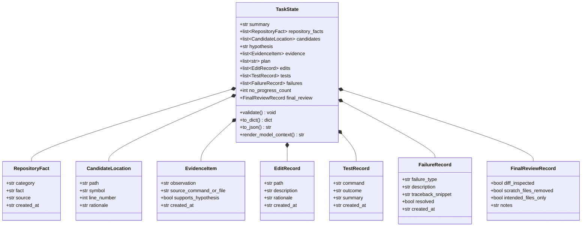

# Architecture Decision Record — Structured Task State

**Document ID:** DEC-STRUCTURED-TASK-STATE  
**Status:** Accepted & Implemented (Stage 11)  
**Date:** 2026-09-26  
**Authoritative References:** [PLAN.md](file:///E:/Projects/Impulse/PLAN.md) (Section 13, Stage 11), [IMPULSE.md](file:///E:/Projects/Impulse/IMPULSE.md), [HARNESS_README.md](file:///E:/Projects/Impulse/data/competition/HARNESS_README.md), [tool_contracts.md](file:///E:/Projects/Impulse/docs/decisions/tool_contracts.md), [patch_capture.md](file:///E:/Projects/Impulse/docs/decisions/patch_capture.md)

---

## 1. Problem Statement & Motivation

During multi-turn autonomous software engineering tasks, agents face three major behavioral failure modes:
1. **Repeated Exploration:** The agent re-inspects previously examined directories and files because earlier observations scroll out of immediate context or lack organized indexing.
2. **Ungrounded Hypothesis Thrashing:** The model shifts from one speculative guess to another without maintaining an explicit record of what was hypothesized, what evidence supported or refuted it, and what remains unverified.
3. **Turn-Budget Degradation:** Without explicit tracking of attempted edits, test outcomes, and failure diagnoses, the agent consumes valuable turns repeating actions or misdiagnosing previously addressed errors.

**PLAN.md Stage 11** mandates introducing an explicit, typed `TaskState` representation to provide turn-to-turn continuity, prevent duplicate exploration, and structure problem-solving without adding retrieval or multi-agent complexity prematurely.

---

## 2. Competition Runtime Analysis & State Persistence Boundary

Before designing the state mechanism, we inspect the authoritative competition runtime (`HARNESS_README.md` and `swegemma` contracts):

### 2.1. Competition Session Primitives
- **ADK `session.state`:** Populated by `run_agent_sandbox` with `{problem_description}` and `{hints}`. Supports string templating in `LlmAgent.instruction`.
- **Predefined Tool Surface:** Strictly limited to the 9 built-in tools (`run_command`, `read_file`, `edit_file`, `write_file`, `get_status`, `submit_patch`, `get_code_neighbors`, `search_similar_code`, `get_code_subgraph`).
- **No Custom Competition Tools:** The harness does **not** provide or allow custom tools such as `update_task_state` or `save_state`. Attempting to register unapproved tools fails harness validation.

### 2.2. Safe Persistence Location
- **Workspace Isolation:** As proven in Stage 7 ([`patch_capture.md`](file:///E:/Projects/Impulse/docs/decisions/patch_capture.md)), any file written directly into `/workspace` (e.g., `/workspace/state.json`) is captured by `git add -N . && git diff HEAD` and **contaminates the candidate patch**.
- **External Storage in `/tmp`:** In accordance with `HARNESS_README.md` Section 9.3, scratch and state files must reside under **`/tmp/`** (e.g., `/tmp/impulse_task_state.json`). Files under `/tmp/` are entirely outside the Git repository root, completely preventing diff pollution.
- **In-Memory Agent State:** The canonical `TaskState` instance is held in Python memory by the runner/agent session manager, with optional JSON serialization to `/tmp` for auditability and session recovery.

---

## 3. Schema Design (`TaskState`)

In strict alignment with **PLAN.md Stage 11**, the schema implements all 11 conceptual fields using Python standard-library dataclasses:

### 3.1. Field Definitions & Rationale
1. **`summary` (`str`):** High-level framing of the problem statement and target resolution criteria.
2. **`repository_facts` (`list[RepositoryFact]`):** Discovered facts regarding test runners (pytest, unittest), package managers, directory layout, and framework idioms.
3. **`candidates` (`list[CandidateLocation]`):** Exact file paths, symbols, and line numbers identified as suspect sites.
4. **`hypothesis` (`str | None`):** Active root cause hypothesis. Strictly nullable; unformulated hypotheses remain `None`.
5. **`evidence` (`list[EvidenceItem]`):** Concrete observations tagged with hypothesis support (`True`, `False`, or `None` for neutral).
6. **`plan` (`list[str]`):** Ordered tactical steps remaining to complete the task.
7. **`edits` (`list[EditRecord]`):** Log of files modified with rationale and timestamp.
8. **`tests` (`list[TestRecord]`):** Targeted test executions with outcomes (`PASS`, `FAIL`, `ERROR`, `TIMEOUT`).
9. **`failures` (`list[FailureRecord]`):** Specific error diagnostics and resolution status (`resolved: bool`).
10. **`no_progress_count` (`int`):** Counter tracking consecutive non-productive actions. Must satisfy invariant $\text{no\_progress\_count} \ge 0$.
11. **`final_review` (`FinalReviewRecord`):** Pre-submission checklist verifying clean diff, scratch file removal, and patch readiness.

---

## 4. Model-Facing Rendering Policy

**Critical Constraint:** The model must **not** receive the entire raw internal state dump on every turn. A raw dump would waste tokens, introduce distracting noise, and degrade reasoning.

The `render_model_context(state)` method extracts a bounded, deterministic markdown representation:
- Summarizes the active task and current hypothesis.
- Displays top tactical plan items.
- Displays key evidence items (bounded to the most recent items).
- Summarizes recent edits and test outcomes.
- Reports active unresolved failures.
- Formats unknown/unformulated fields explicitly (e.g., `None` rendered as `"None formulated yet"`, never assumed to be empty or false).

---

## 5. State Invariants & Update Policies

1. **Non-Negative Progress Invariant:** `no_progress_count >= 0`. Attempts to decrement below 0 are rejected.
2. **Bounded Collection Growth:** List collections enforce upper capacity bounds with FIFO trimming to prevent unbounded memory consumption.
3. **Lossless Serialization Round-Trip:** `TaskState.from_dict(state.to_dict()) == state` is guaranteed deterministically.
4. **Data Sanitization:** Raw multi-thousand-character command outputs are truncated before storing in `TestRecord.summary` or `FailureRecord.traceback_snippet`.
5. **No Secret / Solution Contamination:** State structures never store or inspect `test_patch` or `golden_patch` data.

---

## 6. What Is Intentionally NOT Implemented in Stage 11

In strict adherence to the **Single Dimension of Variation Rule (PLAN.md Section 0)**:
- **NO Context Compaction System:** General token compaction and summarization loops are deferred to Stage 25.
- **NO Semantic Retrieval Tools:** Embedding and vector lookups are deferred to Stage 12 (`search_similar_code`).
- **NO Graph Neighborhood Lookups:** Graph algorithms and AST traversals are deferred to Stage 13 & 14.
- **NO Specialist Sub-Agents:** Multi-agent architectures (Scout, Debugger, Reviewer) are deferred to Stage 15–17.
- **NO Automatic Recovery Logic:** Backtracking on high `no_progress_count` is deferred to Stage 18.
