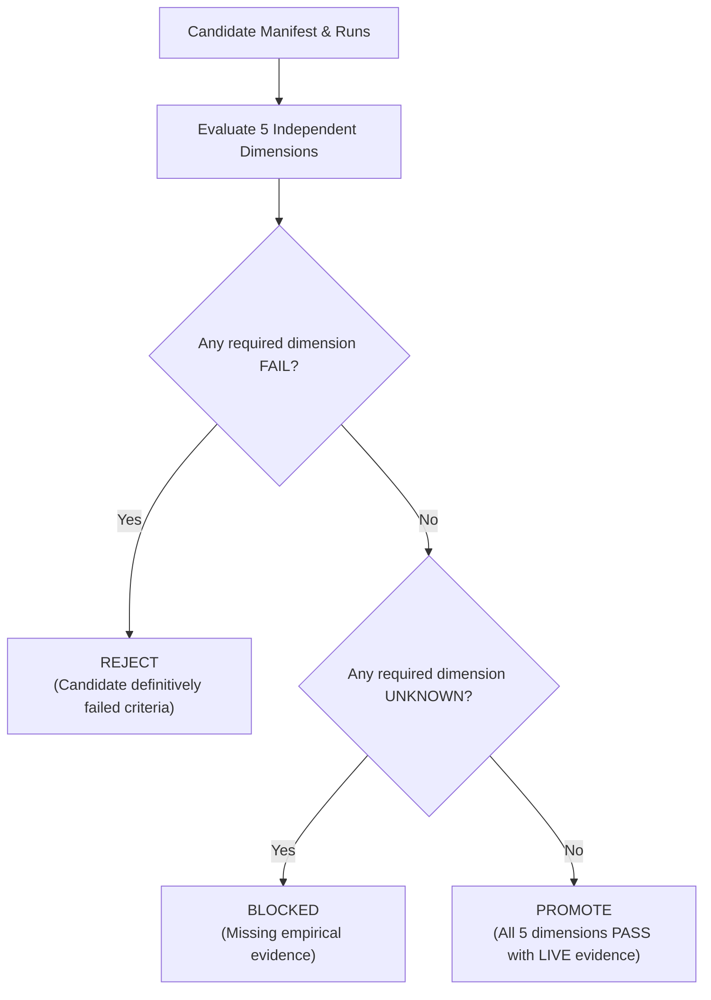

# Candidate Promotion Gate Specification (Stage 44)

This document establishes the authoritative, deterministic candidate promotion gate for the **IMPULSE** software engineering agent repository, enforcing the governance and evaluation principles of [PLAN.md Stage 44](file:///e:/Projects/Impulse/PLAN.md) and [AGENTS.md](file:///e:/Projects/Impulse/AGENTS.md).

---

## 1. Architectural Authority and Purpose

The candidate promotion gate provides an empirical, fail-closed mechanism to answer:
> **"Does this candidate satisfy ALL project promotion requirements?"**

A candidate cannot be promoted merely because:
- it is newer in chronology;
- it incorporates additional heuristics or sub-agents;
- it displays higher scores on local synthetic fixtures;
- a single run or isolated task improved;
- its architecture appears more sophisticated.

Promotion requires simultaneous empirical verification across five independent dimensions without opaque score collapsing.

---

## 2. Core Gate Definition

A candidate is promoted if and only if:

```text
validation improvement
AND
no unacceptable held-out regression
AND
runtime acceptable
AND
configuration valid
AND
behavior reproducible
```

If all five conditions are not definitively met with `LIVE` benchmark results, the candidate is **REJECTED** (if any criterion definitively fails) or **BLOCKED** (if empirical evidence is uncollected or missing).

---

## 3. The Five Gate Dimensions

### Dimension 1: Validation Improvement
- **Baseline Pairing:** The candidate is evaluated against its registered parent baseline on an identical validation task set (`dev` or `validation` split).
- **Primary Metric:** A single authoritative metric is resolved:
  - Default for general agents: `task_success_rate` (`HIGHER_IS_BETTER`).
  - Specialized tool-discipline adapters: `command_redundancy_count` (`LOWER_IS_BETTER`).
- **Contingency Table Analysis:** Per-task paired matching calculates:
  - `baseline_pass_candidate_pass`
  - `baseline_pass_candidate_fail`
  - `baseline_fail_candidate_pass`
  - `baseline_fail_candidate_fail`
  - `validation_tasks_total` and `validation_tasks_changed`.
- **Status Outcomes:**
  - `PASS`: Candidate strictly improves over baseline on primary metric without cherry-picking.
  - `FAIL`: Candidate metric is less than or equal to baseline (`candidate <= baseline`).
  - `UNKNOWN`: Validation evidence missing or uncollected.
  - `NOT_APPLICABLE`: Root seed baseline (no parent).

### Dimension 2: Held-Out Regression
- **Frozen Split Isolation:** Evaluated strictly against the locked held-out split (`held_out`). The held-out split is never used for prompt tuning, retrieval tuning, threshold tuning, or hyperparameter selection.
- **Regression Detection:** Tasks where baseline passed but candidate failed are flagged as direct regressions (`regression_count > 0`).
- **Status Outcomes:**
  - `PASS`: Zero task regressions and overall held-out pass rate is non-decreasing.
  - `FAIL`: Any regression (`regression_count > 0`) or drop in overall held-out score.
  - `UNKNOWN`: Held-out tasks unexecuted or live evidence unavailable.
  - `NOT_APPLICABLE`: Root seed baseline.

### Dimension 3: Runtime Acceptability
- **Budget Compliance:** Inspects average, median, and maximum run latencies and total tool-call volume.
- **Ceiling Constraints:** Measures against configured timeout (e.g. 600–900s) and tool-call quotas.
- **Status Outcomes:**
  - `PASS`: Latency and tool calls remain strictly within budget ceilings.
  - `FAIL`: Maximum latency exceeds hard ceiling budget, or timeouts occur.
  - `UNKNOWN`: Live runtime measurements uncollected.

### Dimension 4: Configuration Validity
- **Structural Integrity:** Agent configuration parses, base model conforms to `gemma-4-31b-it-qat-w4a16-ct`, and submission packaging complies with competition limits (< 3 GiB unpacked).
- **Zero Secrets Policy:** Automated regex scanning confirms zero credentials, API keys, or private tokens.
- **Single-Dimension Control:** Confounding multi-dimensional changes are audited. If multiple major dimensions change without declaring `experiment_type="combined_ablation"`, the configuration is marked `FAIL`.
- **Status Outcomes:**
  - `PASS`: All configuration, security, schema, and single-dimension rules verified.
  - `FAIL`: Schema violation, disallowed model, credentials found, or undeclared multi-dimensional confounding.
  - `UNKNOWN`: Configuration in reserved or draft state (e.g. RC1).

### Dimension 5: Behavior Reproducibility
- **Cryptographic Provenance:** Verifies 40-character Git commit hash, manifest SHA-256 hash, root prompt hash, skill hashes, sub-agent hashes, tool contract hashes, and benchmark split hashes.
- **Determinism:** Verifies sampling settings (`temperature`, `top_p`, `max_output_tokens`) and compute environment ID.
- **Outcome Stability:** Verifies run reproducibility across multiple evaluations, flagging `SINGLE_RUN_EVIDENCE` where applicable.
- **Status Outcomes:**
  - `PASS`: Complete cryptographic provenance and run outcome stability verified.
  - `FAIL`: Corrupted or missing provenance hashes, uncommitted code, or unstable runs.
  - `UNKNOWN`: Static hashes verified, but empirical execution reproducibility cannot be tested due to lack of live cluster runs.

---

## 4. Decision Semantics: PROMOTE vs REJECT vs BLOCKED

Each dimension evaluates to `PASS`, `FAIL`, `UNKNOWN`, or `NOT_APPLICABLE`. The gate evaluates these dimensions independently:



| Decision | Meaning | Action Taken |
|---|---|---|
| **`PROMOTE`** | All required dimensions pass with `LIVE` benchmark results. | Candidate eligible to become active release candidate or new current best. |
| **`REJECT`** | One or more dimensions definitively fail empirical or architectural checks. | Candidate rejected; manifest and metrics preserved for failure learning. |
| **`BLOCKED`** | One or more dimensions lack live empirical evidence (`UNKNOWN`). | Candidate preserved in blocked state; no winner fabricated. |

### Critical Distinction: BLOCKED vs REJECTED
- **`REJECT`** signifies concrete failure: worse validation score, held-out regression, budget violation, or corrupted configuration.
- **`BLOCKED`** signifies missing evidence: external GPU cluster runs have not yet been executed, adapter weights are missing, or release candidate package is pending.
- **An unevaluated candidate must NEVER be called "rejected" merely because evidence is unavailable.**

---

## 5. Evidence Modes and Grounding

Promotion requires empirical evidence grounded in actual execution:
- **`LIVE`:** Real model execution on competition hardware/cluster. **Only `LIVE` evidence satisfies promotion.**
- **`FIXTURE`:** Local mock/synthetic responses. Cannot satisfy live promotion gate.
- **`INFRASTRUCTURE_ONLY`:** Execution attempted on unsupported hardware (e.g. local CPU lacking 4x NVIDIA L4 GPUs) returning `execution_unavailable_local_host`. Evaluates to `UNKNOWN` and results in `BLOCKED`.
- **`UNAVAILABLE`:** No execution runs recorded. Evaluates to `UNKNOWN` and results in `BLOCKED`.

---

## 6. Special Case Governance

### L1 (LoRA Candidate)
- LoRA training was blocked by dataset construction prerequisites (Stage 39).
- No adapter weights exist on disk; Stage 40 ablation was not executed on live hardware.
- Gate Evaluation: `BLOCKED` (missing adapter weights, uncollected live benchmark results).
- Strict Rule: L1 must NEVER be marked `VALIDATED`, `PROMOTED`, or `BEST`.

### RC1 (Release Candidate)
- RC1 represents a reserved release-candidate identity pending final packaging (Stage 50).
- Gate Evaluation: `BLOCKED` with reason `NO_RELEASE_CANDIDATE_CONFIGURATION`.
- Strict Rule: RC1 must NEVER be promoted without a complete, verified submission package.

### M0–M5 (Topology & Submission Packages)
- `M0` through `M5` pass local structural submission checks via `scripts/validate_submission.py`.
- **Structural compliance does NOT equal scientific promotion.**
- Because live cluster benchmark runs have not been executed on local CPU hardware, scientific promotion dimensions are `UNKNOWN`.
- Gate Evaluation: `BLOCKED` pending live cluster benchmarks.

---

## 7. Current-Best Safety and Promotion Lifecycle

- **Promotion Separation:** A candidate can be `VALIDATED` without being `PROMOTED`.
- **Current-Best Integrity:** `experiments/candidates/current_best.json` references the active reference package (`M0`). It is only updated when a candidate passes full gate promotion and supersedes `M0`.
- **Fail-Closed Guarantees:**
  - `scripts/promote_candidate.py` strictly evaluates the gate and aborts if decision != `PROMOTE`.
  - **No `--force` flag or bypass option exists.** Any attempt to pass `--force` immediately raises `ForbiddenBypassError`.
- **Immutable Decisions:** Promotion records are persisted to `experiments/candidates/promotions/<candidate_id>.json` and `<candidate_id>.md`. Lifecycle events (`PROMOTION_EVALUATED`, `PROMOTED`, `REJECTED`) are recorded append-only in `experiments/candidates/history.jsonl`.
