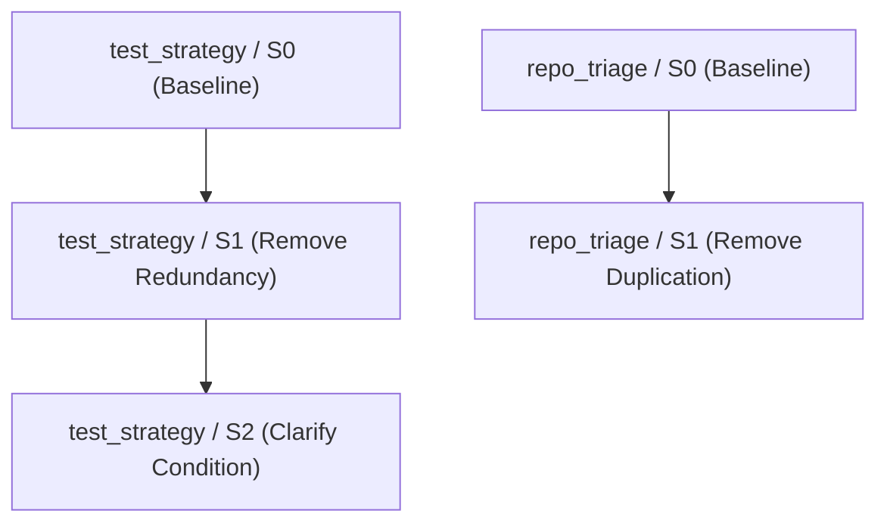

# IMPULSE Stage 36 -- Skill Optimization Loop

## 1. Overview & Core Objective

The **Skill Optimization Loop** addresses the foundational question:

> *"Does a specific skill revision produce measurable behavioral improvement, while avoiding redundant instructions, increased context cost, or unintended regressions?"*

Skills in IMPULSE represent declarative, domain-focused guidance documents providing operational heuristics. However, skills consume scarce input context tokens and can introduce instruction interference, redundancy, or subtle contradictions if not rigorously managed.

Stage 36 treats skills strictly as versioned code and configuration. Every candidate skill modification must be explicitly justified by failure traces, isolated to a single change, tested for domain scope boundaries, analyzed for duplication against the Root Agent Prompt, and compared on paired benchmark task sets.

> [!IMPORTANT]
> **Production Skill Protection Constraint:**
> Stage 36 optimizes skill candidates experimentally under `experiments/skills/`. It does **not** automatically replace or mutate in place the frozen production skill files established at Stage 24 (`agent/skills/test_strategy/SKILL.md` and `agent/skills/repo_triage/SKILL.md`). The frozen Stage 24 baselines remain 100% immutable (14/14 MATCH).

---

## 2. Skill Inventory & Discovered Roles

The authoritative skill inventory discovers and tracks all skill artifacts within the repository:

| Skill ID | Canonical Path | Authoritative SHA-256 (Frozen Stage 24) | Scope | Intended Role |
| :--- | :--- | :--- | :--- | :--- |
| `test_strategy` | `agent/skills/test_strategy/SKILL.md` | `3d027b0f9a7f830bfc68452cc98d962bb702ab16963a62574fcd4e85e31b7148` | `TESTING` | Defect reproduction, targeted verification, test discovery, result interpretation |
| `repo_triage` | `agent/skills/repo_triage/SKILL.md` | `ac7a967136bba6ebd085511595ecbbcd7b3c258927518bfede77cc82a9bb10ce` | `REPOSITORY_TRIAGE` | Language detection, build tool identification, entry points, source layout |

Skills are packaged for competition submission via declarative inclusion in `agent.yaml`.

---

## 3. S0 Baseline Snapshot Model & Immutability

For every optimizer-eligible skill, an immutable **S0 Baseline Snapshot** is captured under `experiments/skills/<skill_id>/S0/`:
- `experiments/skills/test_strategy/S0/SKILL.md`
- `experiments/skills/test_strategy/S0/manifest.json`
- `experiments/skills/repo_triage/S0/SKILL.md`
- `experiments/skills/repo_triage/S0/manifest.json`

S0 manifests record the exact cryptographic SHA-256 digest, baseline commit, declared scope, and invariant system hashes. S0 files are immutable reference standards and are never edited in place.

---

## 4. Candidate Versioning & Lineage Model

Candidates branch from S0 or prior candidate nodes in a structured directed acyclic graph (DAG):



Each candidate directory contains complete provenance and audit artifacts:
- `SKILL.md`: The candidate skill markdown text.
- `manifest.json`: Cryptographic hashes, invariant baseline hashes, hypothesis, and decision.
- `skill_diff.json`: Machine-readable line, character, word, and token deltas.
- `skill_diff.md`: Human-readable markdown diff report.
- `paired_results.jsonl`: Per-task paired outcomes.
- `paired_results.csv`: Tabular task transition metrics.
- `metrics.json`: Context cost and diagnostic indicators.
- `report.md`: Complete audit and reproducibility report.

---

## 5. Single-Change Discipline & Controlled Vocabulary

Each candidate revision is restricted to exactly **one** atomic modification belonging to the controlled change vocabulary:
- `ADD_INSTRUCTION`: Introducing one targeted operational guideline.
- `REMOVE_INSTRUCTION`: Pruning an unhelpful or superseded rule.
- `REWORD_INSTRUCTION`: Refining language for clarity and precision.
- `REORDER_INSTRUCTION`: Adjusting step sequencing to prevent premature actions.
- `TIGHTEN_SCOPE`: Restricting the conditions where an instruction triggers.
- `RELAX_SCOPE`: Permitting broader application under verified guardrails.
- `ADD_SCOPE_BOUNDARY`: Adding an explicit negative constraint.
- `REMOVE_REDUNDANCY`: Pruning content that duplicates root prompt instructions.
- `CLARIFY_CONDITION`: Removing ambiguity from an operational trigger.

Multi-skill mutations (e.g. editing `test_strategy` and `repo_triage` in the same candidate) and non-skill file modifications are strictly rejected by the single-intervention validator.

---

## 6. Scope Enforcement & Domain Boundary Protection

The deterministic scope validator (`local/skill_opt/scope_validator.py`) enforces strict separation of concerns across subsystems:
- **`TESTING` Skill Scope:**
  - *Allowed:* Test discovery, framework inspection, narrow reproduction, test selection, result interpretation.
  - *Forbidden:* Semantic retrieval implementation (`search_similar_code`, `get_code_neighbors`), recovery controller loops (`RecoveryController`, retry bounds), topology routing (`sub_agents/scout`).
- **`REPOSITORY_TRIAGE` Skill Scope:**
  - *Allowed:* Manifest inspection, language/framework identification, entry points, layout mapping.
  - *Forbidden:* Test escalation ladders, recovery retry policies, semantic retrieval implementation.

---

## 7. Root-Prompt Duplication & Internal Redundancy Analysis

A skill must justify its context cost by providing behavior not already guaranteed by the Root Agent Prompt (P0).

The deterministic analyzer (`local/skill_opt/analyzer.py`) segments skill lines and compares them against the normalized root prompt using exact matching and Jaccard token overlap:
- `DUPLICATE`: Verbatim or $\ge 80\%$ token similarity with a root prompt directive.
- `POSSIBLE_DUPLICATE`: $60\% - 80\%$ similarity (conceptual paraphrase).
- `UNIQUE`: Genuine skill-specific guidance ($< 60\%$ overlap).

### Internal Duplication & Bloat Diagnostics
- **Internal Duplication:** Detects repeated instruction pairs within the same skill ($\ge 85\%$ token similarity).
- **Contradiction Heuristics:** Detects conflicting rules (e.g., "always run full suite" vs. "avoid broad suites").
- **Bloat Detection:** Flags empty phrases ("be careful", "write good code", "do your best") and excessive duplication ratios ($\ge 25\%$).

---

## 8. Context Cost & Pareto Evaluation

Token cost is estimated deterministically using character and word length bounds ($\approx 4$ characters or $1.3$ words per token).

Evaluations track:
- Line, word, character, and estimated token deltas.
- Behavioral signals (task success, target failure count, command redundancy, repeated reconnaissance).

### Pareto Classifications
1. `STRICTLY_DOMINATES`: Improved quality with lower or equal context cost.
2. `PARETO_IMPROVEMENT`: Improved quality with neutral context cost.
3. `TRADE_OFF_EXPENSIVE_IMPROVEMENT`: Improved quality but increased token consumption.
4. `LEANER_EQUIVALENT`: Identical quality/parity with reduced token cost.
5. `REGRESSION`: Quality dropped on target or collateral tasks.
6. `STRICTLY_DOMINATED_BLOAT`: Cost increased with no quality improvement.

---

## 9. Paired Task Comparisons & Task-Scope Matrix

Candidates are evaluated against their parent on identical benchmark task sets:
- **Success Transitions:** `PASS_TO_PASS`, `PASS_TO_FAIL` (regression), `FAIL_TO_PASS` (resolved), `FAIL_UNCHANGED`.
- **Behavioral Transitions:** `REDUNDANT_TO_NON_REDUNDANT`, `MISSING_DISCOVERY_TO_CORRECT_DISCOVERY`, `LATE_DISCOVERY_TO_EARLY_DISCOVERY`.

The **Skill-Task Matrix** maps each evaluated task to its expected vs. actual behavior and final verification status.

---

## 10. Invariance Baselines & Non-Skill Fixity

All non-skill system dimensions remain strictly invariant across Stage 36 experiments:
- **Model ID:** `gemma-4-31b-it-qat-w4a16-ct`
- **Root Prompt Baseline:** P0 (`2360d4bf64dd91cb905d1890b903cac26bed792787a79664db42c76cb252527e`)
- **Retrieval Policy:** R0 (`3e1b234a2ac756a8d83395f37f3ddf0043758f5da731c097b412d333a8459cf7`)
- **Testing Policy:** T0 (`76820d5c5e2a983e4d013180d80dda7601b7cba14ad6bebeb56a93e42e730c36`)
- **Recovery Policy:** REC0 (`ee77ab01ea322ad61276eeb627de6eab64f5b732adc868110e8e6f4fdd713f7f`)
- **Multi-Agent Topology:** `root_only`
- **Frozen Stage 24 Artifacts:** 14/14 MATCH
- **Submission Candidates:** M0 through M5 invariant

---

## 11. Current Execution State: Zero Fabrication

Due to local host constraints, live Gemma 4 31B GPU inference is unavailable.
- Live benchmark status is honestly reported as `NO_ACTIONABLE_LIVE_SKILL_DATA`.
- Optimization loop mechanics, validators, diff engines, and metric processors are verified via 35 deterministic fixtures (A through AI).
- No synthetic or fixture scores are ever merged into live benchmark evidence.

---

## 12. CLI Usage Reference

```bash
# Display repository skill inventory and frozen status
python scripts/run_skill_experiment.py --inventory

# Analyze skill duplication and diagnostics against root prompt
python scripts/run_skill_experiment.py --skill test_strategy --candidate S0 --analyze

# Display structured diff against parent
python scripts/run_skill_experiment.py --skill test_strategy --candidate S1 --diff

# View candidate markdown report
python scripts/run_skill_experiment.py --skill test_strategy --candidate S1 --report

# Verify candidate integrity, invariance, and frozen baselines
python scripts/run_skill_experiment.py --skill test_strategy --candidate S1 --verify

# Display top-level skill comparison matrix
python scripts/run_skill_experiment.py --matrix
```
